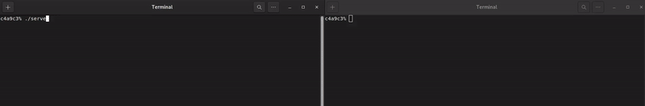

# Minitalk 🗣 - 125/100

### Features
* The communication between client and server is done through SIGUSR1 and SIGUSR2 **only**.
* No global variables.
* Server acknowledges every message received by sending a signal back.
* Unicode characters are supported.
* You can reduce WAIT time in header file if _you gotta go fast_.

### Install and run
1. Clone this repo
2. make
3. Run ./server in a terminal window. You'll get its PID.
4. In another terminal window, run ./client [Server PID] [Your Message].

### Project Step by Step: [Notes](./Notes)
Feel free to check my notes for an explanation of what I learned during this project and how I built it.
