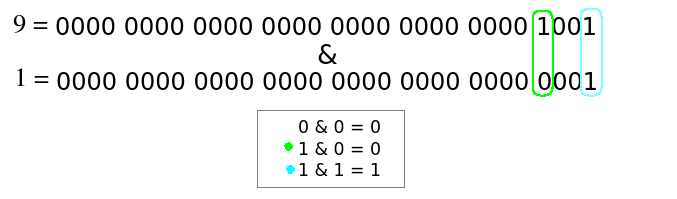

# Minitalk

- Definition
    
    The purpose of this project is to code a small [data exchange](https://en.wikipedia.org/wiki/Data_exchange) program, the minitalk communication protocol, using [UNIX signals](https://www.math.stonybrook.edu/~ccc/dfc/dfc/signals.html).
    
## Step 1: get PID
 > “The server must be started first. After its launch, it has to print its PID.”
    
PID is the *process ID* of the current process, a unique decimal number that can be used, for example, to specify the process when attaching a debugger to it. You might have seen this number before. for example, when you access the system manager (Unix) or task manager (Windows), the PID of a process is under the Details/ID tab.
    
    ```c
    #include **<unistd.h>**
    /*The getpid function returns the process ID of the current process.*/
    pid_t getpid (void);
    ```
You can get the process ID of a process by calling `[getpid()](https://man7.org/linux/man-pages/man2/getpid.2.html)` .  This function returns a number of the data type “[pid_t](https://ftp.gnu.org/old-gnu/Manuals/glibc-2.2.3/html_node/libc_554.html#SEC565)”, which is a signed integer.
    
To use getpid(), just call it in your program. It's part of the <unistd.h> library and it requires no arguments.
    
- chat gpt
        
        **/*System Call**: Internally, getpid() is a system call. When you invoke it, your program transitions from user mode to kernel mode to execute this system call.
        
        **Kernel Interaction**: Inside the kernel, the system call handler for getpid() retrieves the PID associated with the calling process. The PID is a unique identifier assigned by the kernel to each running process on the system.
        
        **Return Value**: Once the system call completes its execution, the PID is returned to the calling program. You can then use this value as needed in your code.
        
        **Usage**: Common uses of getpid() include logging, process management, and creating unique identifiers for inter-process communication.*/
        
## Step 2: client’s parameters
    
> “The client takes two parameters: The server PID and the string to send.” 
    
Error checking:
    
We have to ensure our client only runs when its given 2 parameters, i.e. argc == 3.
    
Check if the PID number that we are receiving in argv[1] is an unsigned integer.
    
Check if the message in argv[2] is not empty;
    
If the input passes all error checks, we can start encoding our message.
    
## Step 3: convert string: bitwise operator and bitshifting
    
 > “The client must send the string passed as a parameter to the server. (…) The communication between your client and your server has to be done only using (…) SIGUSR1 and SIGUSR2.””
    
 We are going to send our message to the sever by sending zeros and ones.
    
To do this, we are going to loop thourgh the string and encode each character into its binary form.
    
Since I already knew the “bruteforce” way of using successive division to convert bases (C Piscine C 04 - ft_putnbr_base), I decided to learn how to convert integers from decimal into binary using bitwise operations. Turns out, it’s much faster than the bruteforce method (time complexity: O(1) vs O(logn)).
    
I found two ways to do this.
    
But first lets talk semantics.
    
The **least significant bit** (LSB) is the bit in a multiple-bit binary number with the smallest value. This is the rightmost bit.
    
The **most significant bit** (MSB) is the bit in a multiple-bit binary number with the largest value. This is the leftmost bit.
 
**Method 1: bitshifting and bitwise operator “and”**
    
We have a loop that iterates over each bit position of an 8-bit char.
    
Inside the loop, right shifting moves each bit to the right by byte number of positions, effectively isolating each bit starting from the leftmost position. We start by moving the MSB (largest value) to the rightmost position (previous LSB), and we store that value in k. If k is 1, “k & 1” will be true. Else, it will be false. We continue looping, doing this for all the following bits.
If still unclear, review bitwise operations (down).
    
- Bitwise operations
        
   **Bitwise AND - &**
        
    If both bits are one, it returns one. Else, it returns zero.
        
  **Bitwise OR - |**
        
   If both bits are zero, it returns zero. Else, it returns one.
        
  **Bitwise EXCLUSIVE - ^**
        
   If both bits are equal, it returns zero. If they are different, it returns one.
        | A | B | & | | | ^ | \
        | 0 | 0 | 0 | 0 | 0 | \
        | 0 | 1 | 0 | 1 | 1 | \
        | 1 | 0 | 0 | 1 | 1 | \
        | 1 | 1 | 1 | 1 | 0 | 
        
   ---
        
   **Bitwise NOT(~)**
        
   Reverses the values. If a bit is one, it sets it to zero. If it’s zero, it sets it to one.
        
  **Left Shift - <<**
        
   Shift the bits in the operand to the left. The result is equal to the operand multiplied by powers of two (n * 2, 4, 8…).
        
   **Right Shift - >>**
        
     Shift the bits in the operand to the right. The result is equal to the operand multiplied by powers of two (n / 2, 4, 8…).
        
     Source: [https://www.startertutorials.com/blog/operators-in-c.html#Bitwise_Operators](https://www.startertutorials.com/blog/operators-in-c.html#Bitwise_Operators)
        
    - Okay but why does “k & 1” work?
        
        “1” is an integer, it has 32 bits.
        
        “1” is represented in binary as “0000 0000 0000 0000 0000 0000 0000 0001”.
        
        So it does not matter how many 1s there are in the binary form of k; the bitwise AND operation only returns 1 when **both** bits are 1, so it can only return 1 if the LSB of k is 1.
        
        Lets visualize this.
        
        For example, lets say int k = 9. 
        The binary representation of 9 is “0000 0000 0000 0000 0000 0000 0000 1001”
        
        
        
        0&0 is always zero. In green, we find the first 1 in k, but it does not matter, since we are comparing it to a 0, and the bitwise AND operation only returns 1 if both bits are 1. In blue, we are in the LSB position, where both are 1 and therefore the result is 1.
        
    - Could I write something else besides “k & 1”?
        
        Yes! “k & 1” is probably the most staightforward one, so I would go with that. But there are other options. Here’s some I came up with:
        
        k | ~1
        
        k | MAX_INT -1
        
        k | 2147483646
        
        k & ~2147483646
        
        k & ~ (MAX_INT -1)
        
        k & (~k + 1)
        
        k & (-k)   
    
    ```c
    void	ft_dtob(int server_id, char c)
    {
    	int	bits;
    	int	k;
    
    	bits = 8;
    	while (byte-- > 0)
    	{
    		k = (int)c >> (bits - 1);
    		if (k & 1)
    			ft_printf("the %dth number counting from right to left is 1\n", byte);
    		else
    			ft_printf("the %dth number counting from right to left is 0\n", byte);
    	}
    }
    ```
    
    More info: [https://www.geeksforgeeks.org/program-decimal-binary-conversion/](https://www.geeksforgeeks.org/program-decimal-binary-conversion/)
    
    **Method 2: same but using a bitmask**
    
    Instead of bitshifting each bite from c to place it in the LSB position, we can use a bitmask. A mask defines which bits you want to keep, and which bits you want to clear. We compare the values of the bitmask with our char and assign it to k. We do the same “if else” statements as above. We continue looping, changing the position of the number “1” (bitshift) in the bitmask once to the right on each iteration.
    
    ```c
    void	ft_dtob(int server_id, char c)
    {
    	int	bits;
    	int	bitmask;
    	int	k;
    
    	bits = 8;
    	bitmask = 0b10000000;
    	while (bits-- > 0)
    	{
    		k = (int)c & bitmask;
    		if (k & 1)
    			ft_printf("the %dth number counting from right to left is 1\n", bits);
    		else
    			ft_printf("the %dth number counting from right to left is 0\n", bits);
    		bitmask = bitmask >> 1;
    	}
    }
    ```
    
    More info: [https://www.youtube.com/watch?v=c3sRgaH2zGA&ab_channel=CodeWithHuw](https://www.youtube.com/watch?v=c3sRgaH2zGA&ab_channel=CodeWithHuw)
    
    It is quite similar to the other example. The only thing that changes is what we bitshift.
    
## Step 4: send SIGUSR1 and SIGUSR2 with kill().
    
SIGUSR1 and SIGUSR2 are custom signals that can be defined by the user (more to that in the next step).
    
 If (k&1), send SIGUSR1 to the server. Else, send SIGUSR2. Do this by using the kill() function.
    
## Step 5: server’s parameters - sigaction
    
> “The communication between your client and your server has to be done only using (…) SIGUSR1 and SIGUSR2.”

SIGUSR1 and SIGUSR2 are custom signals that can be defined by the user. We use sigaction() to specify what action will take place when a certain signal occurs.
    
    ```c
    #include <signal.h>
    
    /*prototype*/
    int sigaction(int signum, const struct sigaction *newact,
    struct sigaction *oldact);
    ```
    
 Underneath the surface, when you make a call to sigaction(), it translates into a system call.
    
 - What is a system call?
        
     A system call is a request made by a program to the operating system's kernel, asking it to perform some operation on its behalf. In the case of sigaction(), the C library's implementation of sigaction() will make a system call to interact with the kernel's signal handling facilities.
        
    
    The sigaction() system call is then used to change the action taken by a process on receipt of a specific signal. 
    
    Signum specifies the signal type. It can be any valid signal except SIGKILL and SIGSTOP. 
    
    As mentioned, we are going to use SIGUSR1 and SIGUSR2.
    
    newact and oldact point to the sigaction struct:
    
    ```c
    /*struct sigaction*/
    struct sigaction {
         void     (*sa_handler)(int);
         void     (*sa_sigaction)(int, siginfo_t *, void *);
         sigset_t   sa_mask;
         int        sa_flags;
         void     (*sa_restorer)(void);
    };
    ```
    
    Struct sigaction is divided in five felds:
    
    The first field of the syructure points to the handler (*sa_handler). The handler is a function that will be called when the signal is caught. It defines the behaviour that follows the reception of a signal (i.e. what is going to happen when a signal arrives). This functions takes one argument - an integer representing the signal number.
    
    The second field, *sa_sigaction, is an alternative to sa_handler. It also points to a function that is called when the signal is caught, but it takes three arguments: int signum - the signal number, siginfo_t *info - a pointer to a structure containing aditional information about the signal, and void *context - a pointer to a context structure, which might contain processor-specific information that might be needed when the signum isn’t enough.
    
    - More sa_sigaction info from our friend chat gpt
        
        The **`sa_sigaction`** field in the **`struct sigaction`** is an alternative to the **`sa_handler`** field for specifying a signal handler function. The main difference is that the **`sa_sigaction`** function takes three arguments instead of one. 
        
        1. **int signum (Signal Number)**:
            - This parameter specifies the signal number that triggered the signal handler. It informs the handler function about which signal it's handling.
            - This parameter provides basic information about the signal, allowing the handler to differentiate between different types of signals.
        2. **siginfo_t *info (Signal Information)**:
            - This parameter is a pointer to a structure of type **`siginfo_t`**, which contains additional information about the signal.
            - The **`siginfo_t`** structure typically includes information such as the PID of the process that sent the signal, the UID of the user who sent the signal, and any additional data specific to certain signals (e.g. the value of a timer that expired).
            - This parameter allows the handler to access more detailed information about the circumstances surrounding the signal, which may be useful for making informed decisions about how to handle it.
        3. **void *context (Signal Context)**:
            - This parameter is a pointer to a context structure, which might contain processor-specific information.
            - The context structure provides additional context about the state of the process at the time the signal was received. This can include information such as register values, stack information, and other details about the process's execution state.
            - While not commonly used, this parameter can be useful for performing advanced signal handling or debugging tasks that require detailed information about the process's state.
        
        You might need to use the **`sa_sigaction`** field instead of **`sa_handler`** in scenarios where you require more detailed information about the signal or the circumstances surrounding its delivery. For example:
        
        - If you need to know the PID of the process that sent the signal or other information about the sender.
        - If you're handling signals related to inter-process communication (e.g., **`SIGPIPE`**, **`SIGCHLD`**) and need to access additional data specific to those signals.
        - If you're implementing advanced signal handling logic that requires detailed information about the process's execution context.
        
        Overall, the **`sa_sigaction`** field provides a more versatile and powerful mechanism for signal handling compared to **`sa_handler`**, as it allows you to access more detailed information about the signals being handled and the context in which they occur.
        
    
    The third field sa_mask allows us to specify a set of signals that we want to block during the execution of the handler.
    
    The sigset_t data type is an array of booleans representing a set of signals. You should always initialize a variable of this data type by calling sigemptyset(&variable). This will clear the array (set all booleans to null).
    
    The fourth field is for flags. You can set them to modify the behavior of the signal handling and control the operations of the system call in more detail. e.g. The flag SA_SIGINFO indicates that the sa_sigaction field should be used instead of sa_handler.
    
    The fifth field is sa_restorer. It points to a function that is called after the signal handler returns, allowing he system to clean up after handling the signals. It's primarily used by the kernel to restore the process's execution state.
    
    We can use these with newact and oldact.
    
    oldact, its where we return the old handler info. We can set oldact to NULL if we are not interested in that.
    
    If newact is non-NULL, the new action for signal signum is installed from act.  If oldact is non-NULL, the previous action is saved in oldact. 
    
    ___________
    
    Each process has a signal mask -  a set of signals currently blocked from delivery.
    
    Blocked signals are held pending and will be delivered when unblocked. - If several signals of the same type are delivered whilst they are blocked, then when they are unblocked onl one will get delivered.
    
    Add or remove signals from the mask using sigprocmask(how, set, oldset);
    
    ___________
    
    **❗Issue**: struct sigaction not recognized by vs code
    
    Despite including <signal.h> in my header, struct sigaction and SA_SIGINFO were not being recognized by vs code. I got the error message “*incomplete type is not allowed*”. 
    
    To solve this, I added the test macro [_GNU_SOURCE](https://man7.org/linux/man-pages/man7/feature_test_macros.7.html) to my header file above my libraries. This instructs the compiler to include additional features and definitions provided by the GNU C Library. Without it, the compiler was using a strict interpretation of the C standard, which did not include the struct sigaction that I needed.
    
## Step 6: Decode string: from signal to char
    
    ```c
    if (signum == SIGUSR1)
    		c += 1 << (7 - bits);
    bits++;
    ```
    
Now we are converting from the signals back into a char.
    We keep track of how many signals we have received (bits) until we reach 8, enough bits to print a char.
    
To do this, we start by checking if we received a SIGUSR1 signal, which indicates a ‘1’ bit. If we get it, we add it to its correct position in c. We are able to do this using bitshifting.
    
 1 in binary is ‘00000001’
    
if we want to add ‘1’ to a certain position in c, we just have to bitshift 1 to the lext until its in the position we want it to be in c. Then, we just add it to c 
    
Once we reach 8 bits, we check if c is not a null terminator. If not, we print it. Else, we print a new line and send a signal back to the client to indicate that the message was received and has finished printing.
    
- Encryption and Decryption
    
    [https://hackmd.io/@rtalbert235/HJb4BhJP5](https://hackmd.io/@rtalbert235/HJb4BhJP5)
